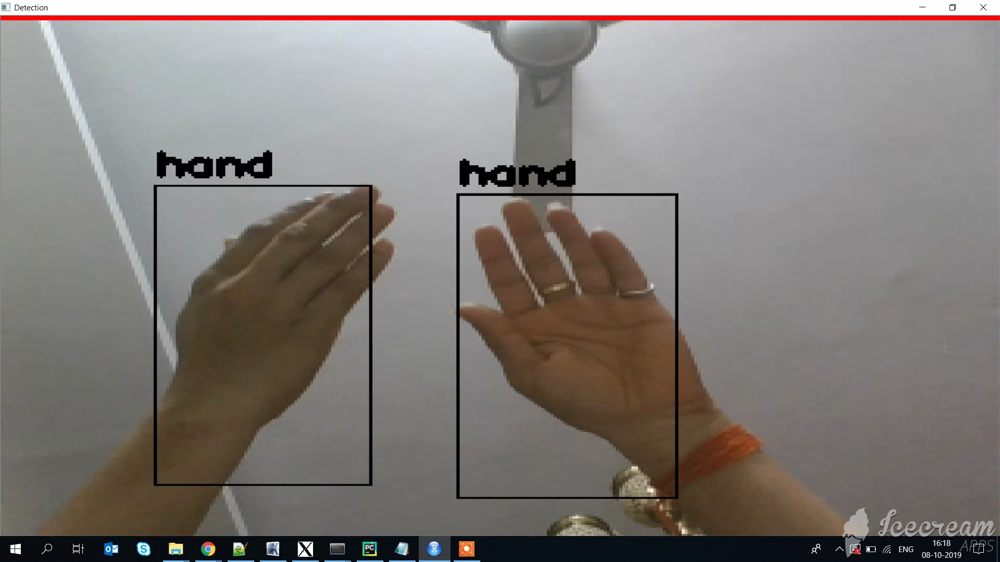
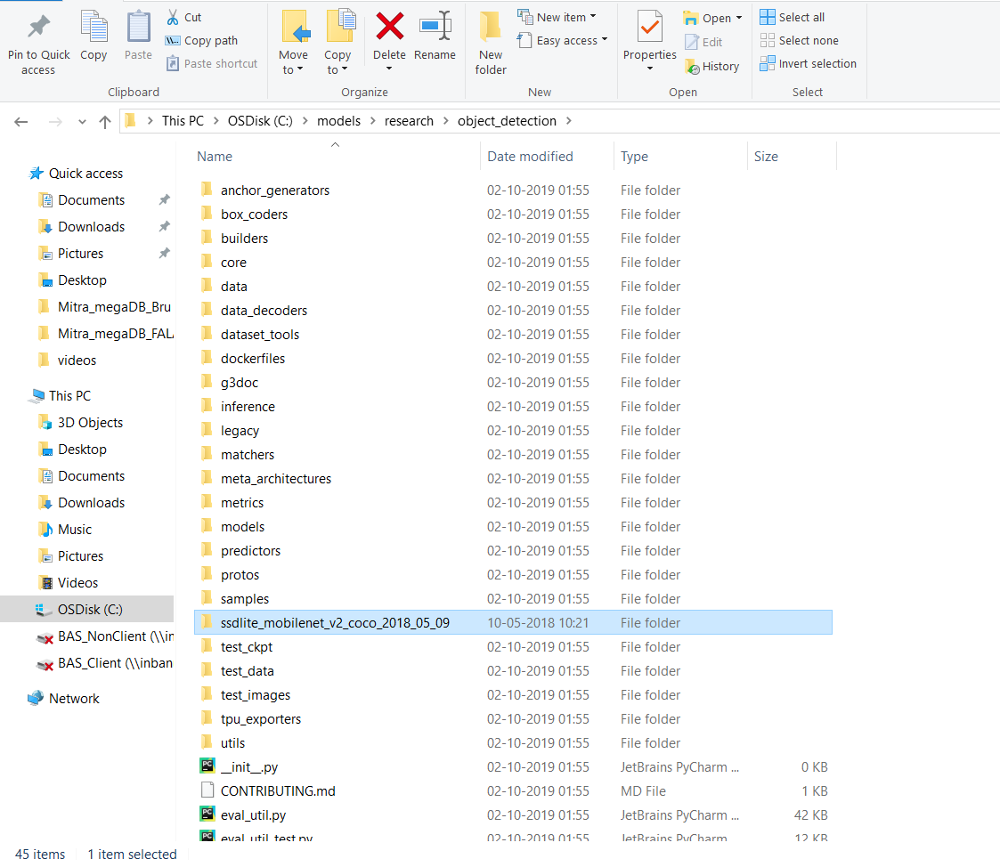
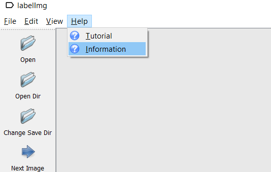

# Training Custom Object Detector Classifier Using TensorFlow Object Detection API on Windows 10

## Summary
This repository is a tutorial for how to use TensorFlow Object Detection API to train an object detection classifier on Windows.

This readme describes every step required to get going with your own object detection classifier: 
1. [Installing Anaconda and NVIDIA GPU drivers](https://github.com/khushi2091/Tensorflow-Custom-Object-Detection-Tutorial#1-installing-anaconda-and-nvidia-gpu-drivers)
2. [Installing TensorFlow and Preparing workspace](https://github.com/khushi2091/Tensorflow-Custom-Object-Detection-Tutorial#2-installing-tensorflow-and-preparing-workspace)
3. [Organizing your Object Detection directory structure](https://github.com/khushi2091/Tensorflow-Custom-Object-Detection-Tutorial#3-organizing-your-object-detection-directory-structure)
4. [Gather data and Generate training data](https://github.com/khushi2091/Tensorflow-Custom-Object-Detection-Tutorial#4-gather-data-and-generate-training-data)
5. [Creating Label Map and TensorFlow Records](https://github.com/khushi2091/Tensorflow-Custom-Object-Detection-Tutorial#5-creating-label-map-and-tensorflow-records)
6. [Configure a training pipeline](https://github.com/khushi2091/Tensorflow-Custom-Object-Detection-Tutorial#6-configure-a-training-pipeline)
7. [Train a model and monitor it's progress]()
8. [Exporting the inference graph]()
9. [Testing and using your newly trained object detection classifier]()

The repository provides all the files needed to train hand detector that can accurately detect hand. The tutorial describes how to replace these files with your own files to train a detection classifier for your own dataset. It also has Python scripts to test your classifier out on an image, video, or webcam feed.

<p align="center">
  
</p>

## Introduction
The purpose of this tutorial is to explain how to train your own Convolutional neural network object detection classifier, starting from scratch. At the end of this tutorial, you will have a program that can identify and draw boxes around specific objects in pictures, videos, or in a webcam feed.

This tutorial also provides instructions for deploying your object classifier model in Edge devices such as Rasberry Pie, Google coral etc. In case you have linux system, You can use this repository in order to train your object detector.

The Object Detection API seems to have been developed on a Linux-based OS. We have another tutorial which has all the steps to train and deploy object detection classiifer in Linux-based OS. This tutorial uses regular TensorFlow for training the object detector clasifier but if you have GPU in your Windows machine, you can use TensorFlow-GPU instead of regular Tensorflow which will increase the training time by a factor of about 8 (3 hours to train instead of 24 hours). The GPU version of TensorFlow can also be used for this tutorial.

## Steps
### 1. Installing Anaconda and NVIDIA GPU drivers
If your system has Nvidia GPU, make sure to install the following in your system:
	Microsoft Visual Studio
	the NVIDIA CUDA Toolkit
	NVIDIA cuDNN
Follow [this YouTube video](https://www.youtube.com/watch?v=cL05xtTocmY), which shows the process for installing Anaconda, CUDA, and cuDNN. The video is made for TensorFlow-GPU v1.4, so download and install the CUDA and cuDNN versions for the latest TensorFlow version, rather than CUDA v8.0 and cuDNN v6.0 as instructed in the video. The [TensorFlow website](https://www.tensorflow.org/install/gpu) indicates which versions of CUDA and cuDNN are needed for the latest version of TensorFlow. Verify the version of CUDA drivers before installation.

I am using Windows which does not have NVIDIA GPU. Hence skipping this step in the YouTube video.

In order to install [Anaconda](https://www.anaconda.com/distribution/#download-section), Download Anaconda for Windows Python 3.7 and follow the steps mentioned [here](https://docs.anaconda.com/anaconda/install/windows/) for installing Anaconda.
#### Note: The current version of Anaconda uses Python 3.7, which is not officially supported by TensorFlow. However, when creating an Anaconda virtual environment during Step 2d of this tutorial, we will tell it to use Python 3.6)

### 2. Installing TensorFlow and Preparing workspace
Lets create an virtual environment in order to setup the Custom Tensorflow object detetction setup for your own data. From the Start menu in Windows, search for the Anaconda Prompt utility, right click on it, and click “Run as Administrator”. If Windows asks you if you would like to allow it to make changes to your computer, click Yes. It also requires several additional Python packages, specific additions to the PATH and PYTHONPATH variables, and a few extra setup commands to get everything set up to run or train an object detection model.

#### 2.1 Set up new Anaconda virtual environment
In the command terminal that pops up, run the following command to create virtual environment:
```
C:\> conda create -n TF_object_detection pip python=3.6
```

Then, activate the environment using the following command
```
C:\> activate TF_object_detection

```

For detailed steps to install Tensorflow, follow the [Tensorflow installation instructions](https://www.tensorflow.org/install/pip#3.-install-the-tensorflow-pip-package). A typical user can install Tensorflow using one of the following commands:
```
# For CPU
(TF_object_detection) C:\>  pip install tensorflow
# For GPU
(TF_object_detection) C:\> pip install tensorflow-gpu
```

Install the other necessary packages by issuing the following commands:
```
(TF_object_detection) C:\> conda install -c anaconda protobuf
(TF_object_detection) C:\> pip install Cython
(TF_object_detection) C:\> pip install contextlib2
(TF_object_detection) C:\> pip install pillow
(TF_object_detection) C:\> pip install lmxl
(TF_object_detection) C:\> pip install pandas
(TF_object_detection) C:\> pip install matplotlib
```

#### 2.2 TensorFlow Object Detection API setup
Download the full TensorFlow object detection repository located [here](https://github.com/tensorflow/models/archive/master.zip). Once the "models-master.zip" file will get downloaded, extract the “models-master” folder and rename “models-master” to just “models”.

#### Download pre-trained model

TensorFlow provides several object detection models (pre-trained classifiers with specific neural network architectures) in its [model zoo](https://github.com/tensorflow/models/blob/master/research/object_detection/g3doc/detection_model_zoo.md). We can take any of the pre-trained models in order to train our object detection classifier. The important thing to notice here is the performance of the model. Some models (such as the SSD-MobileNet model) have an architecture that allows for faster detection but with less accuracy, while some models (such as the Faster-RCNN model) give slower detection but with more accuracy.
We are planning to run the hand detector model in Edge devices such as Rasberry pie or Google coral (Note: We have separate tutorial for creating Custom Object detector classifier in Google coral where the Quantized model such as SSD-Mobilenet-V2-Quantized has been used). We have started with SSD-Inception-V2 mode but it was quite slow while running live in a video stream. I re-trained my classifier with SSD-Mobilenet-V2 model and the detection speed quite improved but with a lower accuracy. In order to improve the accuracy, the training has been done for a large no. of steps.

In this tutorial, we will use the SSD-Mobilenet-V2 model which can be downloaded [here](http://download.tensorflow.org/models/object_detection/ssd_mobilenet_v2_coco_2018_03_29.tar.gz). Open the downloaded ssd_mobilenet_v2_coco_2018_03_29.tar.gz file with a file archiver such as WinZip or 7-Zip and extract the ssd_mobilenet_v2_coco_2018_03_29 folder to the C:\models\research\object_detection folder.

At this point, here is what your C:\models\research\object_detection folder should look like:

<p align="center">
  
</p>

Inside any of the model directory, you will find:

* a graph proto (`graph.pbtxt`)
* a checkpoint
  (`model.ckpt.data-00000-of-00001`, `model.ckpt.index`, `model.ckpt.meta`)
* a frozen graph proto with weights baked into the graph as constants
  (`frozen_inference_graph.pb`) to be used for out of the box inference
    (try this out in the Jupyter notebook!)
* a config file (`pipeline.config`) which was used to generate the graph.

### 3. Organizing your Object Detection directory structure
Create a folder name as "TF_object_detection" inside C:/ drive. Move the "model" directory inside TF_object_detection such that "C:/TF_object_detection/models/research/object_detection/" this working directory will contain the full TensorFlow object detection framework, as well as your training images, training data, trained classifier, configuration files, and everything else needed for the object detection classifier.

        TF_object_detection
        ├─ models
        │   ├─ official
        │   ├─ research
        │   ├─ samples
        │   └─ tutorials
			
#### 3.1 Protobuf compilation
The Tensorflow Object Detection API uses Protobufs to configure model and training parameters. Before the framework can be used, the Protobuf libraries must be compiled. This should be done by running the following command from the C:/TF_object_detection/models/research/ directory
```
(TF_object_detection) C:\> cd C:\TF_object_detection\models\research
(TF_object_detection) C:\TF_object_detection\models\research> protoc --python_out=. ./object_detection/protos/anchor_generator.proto ./object_detection/protos/argmax_matcher.proto ./object_detection/protos/bipartite_matcher.proto ./object_detection/protos/box_coder.proto ./object_detection/protos/box_predictor.proto ./object_detection/protos/eval.proto ./object_detection/protos/faster_rcnn.proto ./object_detection/protos/faster_rcnn_box_coder.proto ./object_detection/protos/grid_anchor_generator.proto ./object_detection/protos/hyperparams.proto ./object_detection/protos/image_resizer.proto ./object_detection/protos/input_reader.proto ./object_detection/protos/losses.proto ./object_detection/protos/matcher.proto ./object_detection/protos/mean_stddev_box_coder.proto ./object_detection/protos/model.proto ./object_detection/protos/optimizer.proto ./object_detection/protos/pipeline.proto ./object_detection/protos/post_processing.proto ./object_detection/protos/preprocessor.proto ./object_detection/protos/region_similarity_calculator.proto ./object_detection/protos/square_box_coder.proto ./object_detection/protos/ssd.proto ./object_detection/protos/ssd_anchor_generator.proto ./object_detection/protos/string_int_label_map.proto ./object_detection/protos/train.proto ./object_detection/protos/keypoint_box_coder.proto ./object_detection/protos/multiscale_anchor_generator.proto ./object_detection/protos/graph_rewriter.proto ./object_detection/protos/calibration.proto ./object_detection/protos/flexible_grid_anchor_generator.proto
```
This creates a name_pb2.py file from every name.proto file in the \object_detection\protos folder.

#### 3.2 Add libraries to PYTHONPATH
When running locally, the tensorflow/models/research/ and slim directories should be appended to PYTHONPATH. This can be done by running the following from TF_object_detection/models/research/:
```
# From tensorflow/models/research/

(TF_object_detection) C:\> cd C:\TF_object_detection\models\research
(TF_object_detection) C:\TF_object_detection\models\research> set PYTHONPATH=C:\TF_object_detection\models;C:\TF_object_detection\models\research;C:\TF_object_detection\models\research\slim

```
**(Note: This command needs to run from every new terminal you start. Every time the "TF_object_detection" virtual environment is exited, the PYTHONPATH variable is reset and needs to be set up again. You can use "echo %PYTHONPATH% to see if it has been set or not.)

Finally, run the following commands from the C:\TF_object_detection\models\research directory:
```
(TF_object_detection) C:\TF_object_detection\models\research> python setup.py build
(TF_object_detection) C:\TF_object_detection\models\research> python setup.py install
```

#### 3.3 Testing the Installation
You can test that you have correctly installed the Tensorflow Object Detection API by running the following command from the C:\TF_object_detection\models\research directory:

```
(TF_object_detection) C:\TF_object_detection\models\research> python object_detection\builders\model_builder_test.py
```

### 4. Gather data and Generate training data
Create a folder inside C:\TF_object_detection\models\research\object_detection and name it as "hand_detector". Download the full repository located on this page after clicking [here](https://github.com/khushi2091/Tensorflow-Custom-Object-Detection-Tutorial/archive/master.zip). Extract all the content of "Tensorflow-Custom-Object-Detection-Tutorial" inside the folder created just now (hand_detector).
You will have the following directory structure in your system:

	TF_object_detection
        ├─ models
        │   ├─ official
        │   ├─ research
		│   	└─ object_detection
		│   		└─ hand_detector
		│   			└─ xml_to_csv.py
		│   			└─ generate_tfrecord.py
		│   			└─ test_data
		│   			└─ images
		│   				└─ train
		│   				└─ test
        │   ├─ samples
        │   └─ tutorials
        └─ workspace
            └─ training_demo

Here is an explanaion of the following foders:
- ``images``: This folder contains a copy of all the images we have taken for training hand detetcor model, as well as the respective ``*.xml`` files produced for each one, once [``labelImg``](https://drive.google.com/open?id=1MTu9ZkS4kXe5A26F76tbwBtsWS9YgTLt) is used to annotate objects.

    * ``images\train``: This folder contains a copy of all images, and the respective ``*.xml`` files, which will be used to train our model.
    * ``images\test``: This folder contains a copy of all images, and the respective ``*.xml`` files, which will be used to test our model.

After you have all the pictures you need, move 20% of them to the \object_detection\hand_detector\images\test directory, and 80% of them to the \object_detection\hand_detector\train directory. Make sure there are a variety of pictures in both the \test and \train directories.

#### 4.1 Annotating images

We have annotated the images using a tool called LabelImg. It is a great tool for labeling images, and its [GitHub](https://github.com/tzutalin/labelImg) page has very clear instructions on how to install and use it.
You can also execute this tool directly from the below given link:
**[Download LabelImg](https://drive.google.com/open?id=1MTu9ZkS4kXe5A26F76tbwBtsWS9YgTLt)

Note: Verify the version of labelImg in the following way:
- Open LabelImg directly from the shared executable file (labelImg.exe) or with the help of steps given on github page
- Go to help follwed by Information as shown here:
<p align="center">
  
</p>
- Please make sure the version of LabelImg app should be 1.6.0 as shown below:
<p align="center">
  
</p>

Download and install LabelImg, and open the directory wherever your training images are located(C:\TF_object_detection\models\research\object_detection\hand_detector\images\train) using ``Open Dir`` option as shown below in the upper left corner. Now, draw a box around each object in each image for which you would like to train your object detetcor. Repeat the process for all the images in the C:\TF_object_detection\models\research\object_detection\hand_detector\images\test directory. It is a manual process hence it will take some time.
<p align="center">
  
</p>

Once the box is created, save the xml file created by LabelImg which contains the label data for each image. These .xml files will be used to generate TFRecords, which are one of the inputs to the TensorFlow trainer. Verify that you have label (i.e. .xml file) for each of the image in the \test and \train directories.

### 5. Creating Label Map and TensorFlow Records
Once labelling of all the images are done, we will create the TFRecords that serve as input data to the TensorFlow training model.

#### 5.1 Creating Label Map
TensorFlow requires a label map, which namely maps each of the used labels to an integer values. This label map is used both by the training and detection processes.

Below I have given an example for updating the label map (e.g label_map.pbtxt) as per your dataset, assuming that our dataset containes 1 labels, hand:

```
item {
  id: 1
  name: 'hand'
}
```
This labelmap tells the trainer what each object is by defining a mapping of class names to class ID numbers. You can define the labelmap for multiple objects by appending the entries with keys 2, 3, 4, and so on.

**Note: It should contain the exact name what you have given in step 4 while labelling of the images. These labels are case sensitive, hence give the exact name.

#### 5.2 Creating TFRecords
Now that we have generated our annotations and split our dataset into the desired training and testing subsets, it is time to convert our annotations into the so called TFRecord format.

There are two steps in doing so:

- Converting the individual *.xml files to a unified *.csv file for each dataset.
	The following command should execute in order to create train data:
	```
	python xml_to_csv.py -i [PATH_TO_IMAGES_FOLDER]/train -o [PATH_TO_ANNOTATIONS_FOLDER]/train_labels.csv
	```
	Run the following command from C:\TF_object_detection\models\research directory:
	```
	(TF_object_detection) C:\> cd TF_object_detection\models\research\object_detection
	(TF_object_detection) C:\TF_object_detection\models\research\object_detection> python hand_detector\xml_to_csv.py -i hand_detector\images\train -o hand_detector\images\train\train_labels.csv
	```

	The following command should execute in order to create test data:
	```
	python xml_to_csv.py -i [PATH_TO_IMAGES_FOLDER]/test -o [PATH_TO_ANNOTATIONS_FOLDER]/test_labels.csv
	```
	Run the following command from C:\TF_object_detection\models\research directory:
	```
	(TF_object_detection) C:\> cd TF_object_detection\models\research\object_detection
	(TF_object_detection) C:\TF_object_detection\models\research\object_detection> python hand_detector\xml_to_csv.py -i hand_detector\images\train -o hand_detector\images\train\test_labels.csv
	```
	This will create train_labels.csv and test_labels.csv file inside \object_detection\hand_detector\images folder.

- Converting the *.csv files of each dataset to *.record files (TFRecord format).
	Now that we have obtained our *.csv annotation files, we will need to generate the TFRecords that serve as input data to the TensorFlow training model.
	Next, open the **generate_tfrecord.py** file located in TF_object_detection\models\research\object_detection directory in a text editor.
	
	```
	# TO-DO replace this with label map
	def class_text_to_int(row_label):
		if row_label == 'hand':
			return 1
		else:
			None
	```
	Here is an example of multiple object detector such as Apple, Orange, Banana. Replace the label map starting at line 31 with your own label map, where each object is assigned an ID number. This same number assignment will be used when configuring the labelmap.pbtxt file as shown below:
	```
	item {
	  id: 1
	  name: 'apple'
	}
	item {
	  id: 2
	  name: 'orange'
	}
	item {
	  id: 3
	  name: 'banana'
	}

	```
	Accordingly, the required changes needs to be done in generate_tfrecord.py as given below:
	```
	def class_text_to_int(row_label):
    if row_label == 'apple':
        return 1
    elif row_label == 'orange':
        return 2
    elif row_label == 'banana':
        return 3
    else:
        None
	```
	**Once these changes are done, run the following command from TF_object_detection\models\research\object_detection directory in order to create tfrecords for train and test data:
	```
	(TF_object_detection) C:\TF_object_detection\models\research\object_detection> python generate_tfrecord.py --csv_input=hand_detector\images\train\train_labels.csv --output_path=hand_detector\train.record --img_path=hand_detector\images\train
	(TF_object_detection) C:\TF_object_detection\models\research\object_detection> python generate_tfrecord.py --csv_input=hand_detector\images\test\test_labels.csv --output_path=hand_detector\test.record --img_path=hand_detector\images\test
	```
	After running these two commands, there should be two new files under the training_demo\annotations folder, named test.record and train.record, respectively.

### 6. Configure a training pipeline
	
